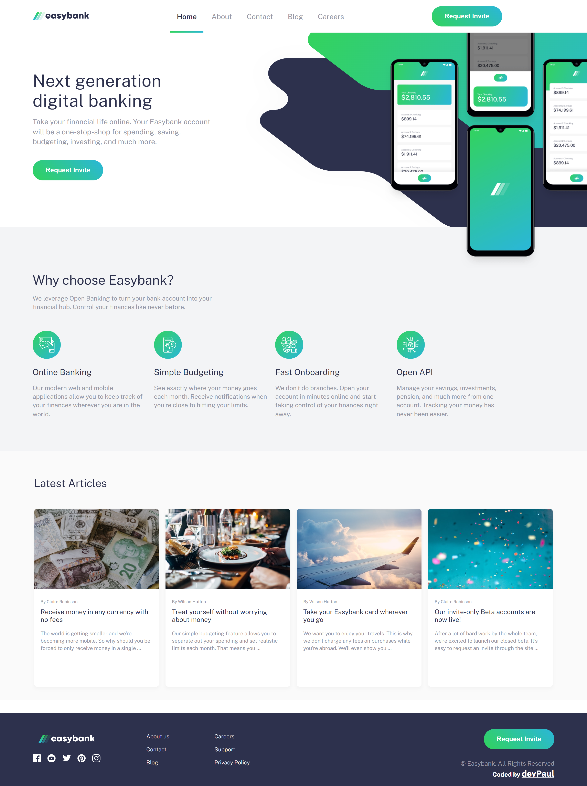

# Frontend Mentor - Easybank landing page solution

This is a solution to the [Easybank landing page challenge on Frontend Mentor](https://www.frontendmentor.io/challenges/easybank-landing-page-WaUhkoDN). Frontend Mentor challenges help you improve your coding skills by building realistic projects. 

## Overview

### The challenge

Users should be able to:

- View the optimal layout for the site depending on their device's screen size
- See hover states for all interactive elements on the page

### Screenshots

**(CLICK to see)**

   

Desktop design

   

Tablet design

   

Mobile design

   

Mobile menu design

### Links

- Solution URL: [https://www.frontendmentor.io/solutions/frontend-mentor-easybank-landing-page-GPvZLRXA4J](https://www.frontendmentor.io/solutions/frontend-mentor-easybank-landing-page-GPvZLRXA4J)
- Live Site URL: [https://dev-paull.github.io/easybank-landing-page/](https://dev-paull.github.io/easybank-landing-page/)

